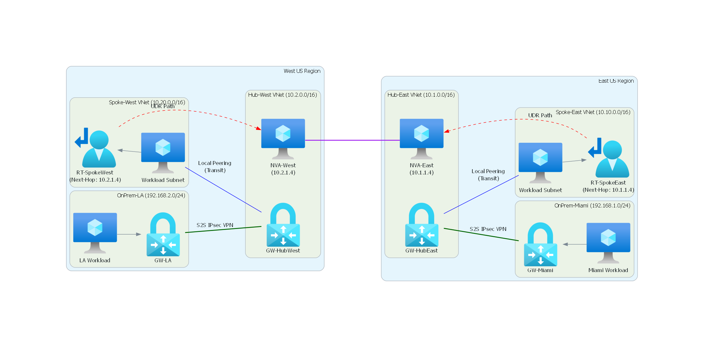

# 🏗️ Azure Hybrid Network Architecture Lab: Dual-Region Hub & Spoke

> **AZ-104 Learning Lab**: This hands-on lab demonstrates how to build a highly available, dual-region Hub-and-Spoke network architecture in Azure. It explicitly tackles the complexities of **Gateway Transit** and **Transitive Routing**, proving why pure VNet peering is not enough for cross-region Spoke-to-Spoke or Spoke-to-Remote-On-Premises connectivity.


---

## 🎯 Objective

Build a production-ready Azure network topology that includes:
- **Dual-region Hubs** (East US & West US) with VPN Gateways and Network Virtual Appliances (NVAs)
- **Local Spokes** peered to their respective hubs
- **Simulated On-Premises** networks connected via IPsec Site-to-Site (S2S) VPN
- **Gateway Transit** configuration for Spoke-to-On-Premises connectivity
- **Transitive Routing** via NVAs and User Defined Routes (UDRs) for Spoke-to-Spoke connectivity

---

## 🏛️ Architecture Overview

| Component | Region | VNet Address | Key Components |
|-----------|--------|--------------|----------------|
| **Hub-East** | East US | `10.1.0.0/16` | VPN Gateway 1, NVA (Linux Router) |
| **Hub-West** | West US | `10.2.0.0/16` | VPN Gateway 2, NVA (Linux Router) |
| **Spoke-East** | East US | `10.10.0.0/16` | Workload Subnet |
| **Spoke-West** | West US | `10.20.0.0/16` | Workload Subnet |
| **OnPrem-Miami** | East US | `192.168.1.0/24` | Simulated On-Prem (S2S VPN) |
| **OnPrem-LA** | West US | `192.168.2.0/24` | Simulated On-Prem (S2S VPN) |



### Key Network Concepts Demonstrated

| Concept | Problem | Solution in This Lab |
|---------|---------|---------------------|
| **Gateway Transit** | Spokes can't reach On-Premises through Hub's gateway by default | Enable `--allow-gateway-transit` on Hub2Spoke peering and `--use-remote-gateways` on Spoke2Hub peering |
| **Transitive Routing** | VNet peering is non-transitive (Spoke-East → Hub-East → Hub-West → Spoke-West fails) | Deploy Linux NVAs with IP forwarding + UDRs pointing to NVA as next-hop |
| **Forwarded Traffic** | NVAs won't accept cross-region traffic without this flag | Enable `--allow-forwarded-traffic true` on Hub-to-Hub peering |

---

## ⚠️ Prerequisites & Cost Warning

### Requirements
- ✅ Azure CLI installed (`az --version` ≥ 2.0) **OR** active [Azure Cloud Shell](https://shell.azure.com) session
- ✅ Azure subscription with permissions to create:
  - Resource Groups
  - VNets & Subnets
  - VPN Gateways (VpnGw1 SKU)
  - VMs (Ubuntu 22.04)
  - Public IPs, NICs, Route Tables

### 💰 Cost Warning
| Resource | Count | Estimated Cost/hour |
|----------|-------|-------------------|
| VPN Gateway (VpnGw1) | 4 | ~$0.25–$0.35 each |
| Ubuntu VMs (NVA + Test) | 4+ | ~$0.02–$0.05 each |
| Public IPs | 4 | ~$0.02 each |
| **Total (active)** | | **~$1.50–$2.50/hour** |

> 🚨 **CRITICAL**: Delete the resource group immediately after testing (`az group delete --name AZ-Hybrid-Lab-RG --yes --no-wait`) to avoid high charges.

### ⏱️ Time Estimate
- **VPN Gateway deployment**: 30–45 minutes **each** (4 gateways = ~2–3 hours total wait time)
- **Active lab work**: 60–90 minutes after gateways are ready
- **Total project time**: ~3–4 hours (mostly waiting)

---

## 🛠️ Step 1: Base Infrastructure Setup (VNets & Subnets)

Create the Resource Group, Hub VNets, Spoke VNets, and Simulated On-Premises VNets.

```bash
# Variables
RG="AZ-Hybrid-Lab-RG"
LOC_EAST="eastus"
LOC_WEST="westus"

# Create Resource Group
az group create --name $RG --location $LOC_EAST

# 1. Create Hubs (with GatewaySubnet and NVA Subnets)
az network vnet create -g $RG -n Hub-East -l $LOC_EAST --address-prefix 10.1.0.0/16 \
  --subnet-name GatewaySubnet --subnet-prefix 10.1.255.0/27
az network vnet subnet create -g $RG --vnet-name Hub-East -n NvaSubnet --address-prefixes 10.1.1.0/24

az network vnet create -g $RG -n Hub-West -l $LOC_WEST --address-prefix 10.2.0.0/16 \
  --subnet-name GatewaySubnet --subnet-prefix 10.2.255.0/27
az network vnet subnet create -g $RG --vnet-name Hub-West -n NvaSubnet --address-prefixes 10.2.1.0/24

# 2. Create Spokes (with Workload Subnets)
az network vnet create -g $RG -n Spoke-East -l $LOC_EAST --address-prefix 10.10.0.0/16 \
  --subnet-name WorkloadSubnet --subnet-prefix 10.10.1.0/24

az network vnet create -g $RG -n Spoke-West -l $LOC_WEST --address-prefix 10.20.0.0/16 \
  --subnet-name WorkloadSubnet --subnet-prefix 10.20.1.0/24

# 3. Create Simulated On-Premises VNets
az network vnet create -g $RG -n OnPrem-Miami -l $LOC_EAST --address-prefix 192.168.1.0/24 \
  --subnet-name GatewaySubnet --subnet-prefix 192.168.1.0/27
az network vnet subnet create -g $RG --vnet-name OnPrem-Miami -n WorkloadSubnet --address-prefixes 192.168.1.128/25

az network vnet create -g $RG -n OnPrem-LA -l $LOC_WEST --address-prefix 192.168.2.0/24 \
  --subnet-name GatewaySubnet --subnet-prefix 192.168.2.0/27
az network vnet subnet create -g $RG --vnet-name OnPrem-LA -n WorkloadSubnet --address-prefixes 192.168.2.128/25
```

---

## 🛠️ Step 2: Deploy VPN Gateways & S2S Connections

> ☕ **Grab a coffee!** These commands will take 30–45 minutes each to complete.

```bash
# 1. Create Public IPs for all 4 Gateways
az network public-ip create -g $RG -n PIP-GW-HubEast --sku Standard -l $LOC_EAST
az network public-ip create -g $RG -n PIP-GW-HubWest --sku Standard -l $LOC_WEST
az network public-ip create -g $RG -n PIP-GW-Miami --sku Standard -l $LOC_EAST
az network public-ip create -g $RG -n PIP-GW-LA --sku Standard -l $LOC_WEST

# 2. Create the VPN Gateways (Runs asynchronously)
az network vnet-gateway create -g $RG -n GW-HubEast -l $LOC_EAST --public-ip-address PIP-GW-HubEast --vnet Hub-East --sku VpnGw1 &
az network vnet-gateway create -g $RG -n GW-HubWest -l $LOC_WEST --public-ip-address PIP-GW-HubWest --vnet Hub-West --sku VpnGw1 &
az network vnet-gateway create -g $RG -n GW-Miami -l $LOC_EAST --public-ip-address PIP-GW-Miami --vnet OnPrem-Miami --sku VpnGw1 &
az network vnet-gateway create -g $RG -n GW-LA -l $LOC_WEST --public-ip-address PIP-GW-LA --vnet OnPrem-LA --sku VpnGw1 &

# Wait for background jobs to finish before proceeding
wait
```

### Connect Hubs to On-Premises (VNet-to-VNet IPsec)

```bash
# Miami <--> Hub-East
az network vpn-connection create -g $RG -n HubEast-to-Miami --vnet-gateway1 GW-HubEast --vnet-gateway2 GW-Miami --shared-key "SecretLabKey123" -l $LOC_EAST
az network vpn-connection create -g $RG -n Miami-to-HubEast --vnet-gateway1 GW-Miami --vnet-gateway2 GW-HubEast --shared-key "SecretLabKey123" -l $LOC_EAST

# LA <--> Hub-West
az network vpn-connection create -g $RG -n HubWest-to-LA --vnet-gateway1 GW-HubWest --vnet-gateway2 GW-LA --shared-key "SecretLabKey123" -l $LOC_WEST
az network vpn-connection create -g $RG -n LA-to-HubWest --vnet-gateway1 GW-LA --vnet-gateway2 GW-HubWest --shared-key "SecretLabKey123" -l $LOC_WEST
```

---

## 🛠️ Step 3: VNet Peering (Applying the Logic Fixes)

Configure peering correctly with **Gateway Transit** enabled for Spokes.

```bash
# 1. Hub-East <--> Hub-West (Global Peering)
# FIX: 'allow-forwarded-traffic' is required for NVAs to accept cross-region spoke traffic
az network vnet peering create -g $RG -n HubEast-to-HubWest --vnet-name Hub-East --peer-vnet Hub-West --allow-forwarded-traffic true
az network vnet peering create -g $RG -n HubWest-to-HubEast --vnet-name Hub-West --peer-vnet Hub-East --allow-forwarded-traffic true

# 2. Hub-East <--> Spoke-East (Local Peering)
# FIX: allow-gateway-transit and use-remote-gateways are absolutely required here
az network vnet peering create -g $RG -n HubEast-to-SpokeEast --vnet-name Hub-East --peer-vnet Spoke-East --allow-gateway-transit true
az network vnet peering create -g $RG -n SpokeEast-to-HubEast --vnet-name Spoke-East --peer-vnet Hub-East --use-remote-gateways true

# 3. Hub-West <--> Spoke-West (Local Peering)
az network vnet peering create -g $RG -n HubWest-to-SpokeWest --vnet-name Hub-West --peer-vnet Spoke-West --allow-gateway-transit true
az network vnet peering create -g $RG -n SpokeWest-to-HubWest --vnet-name Spoke-West --peer-vnet Hub-West --use-remote-gateways true
```

---

## 🛠️ Step 4: The Transitive Fix (NVAs and UDRs)

Deploy Ubuntu VMs with **IP forwarding enabled** to act as routers, then configure UDRs.

```bash
# 1. Create NICs with IP Forwarding Enabled
az network nic create -g $RG -n NVA-East-NIC --vnet-name Hub-East --subnet NvaSubnet --ip-forwarding true --private-ip-address 10.1.1.4
az network nic create -g $RG -n NVA-West-NIC --vnet-name Hub-West --subnet NvaSubnet --ip-forwarding true --private-ip-address 10.2.1.4

# 2. Deploy Linux VMs as NVAs
az vm create -g $RG -n NVA-East --nics NVA-East-NIC --image Ubuntu2204 --admin-username azureuser --generate-ssh-keys --custom-data "#!/bin/bash\nsysctl -w net.ipv4.ip_forward=1"
az vm create -g $RG -n NVA-West --nics NVA-West-NIC --image Ubuntu2204 --admin-username azureuser --generate-ssh-keys --custom-data "#!/bin/bash\nsysctl -w net.ipv4.ip_forward=1"

# 3. Create and Assign User Defined Routes (UDRs) to Spokes
# Spoke-East: Route to Spoke-West via NVA-East
az network route-table create -g $RG -n RT-SpokeEast -l $LOC_EAST
az network route-table route create -g $RG --route-table-name RT-SpokeEast -n RouteToSpokeWest --address-prefix 10.20.0.0/16 --next-hop-type VirtualAppliance --next-hop-ip-address 10.1.1.4
az network vnet subnet update -g $RG --vnet-name Spoke-East -n WorkloadSubnet --route-table RT-SpokeEast

# Spoke-West: Route to Spoke-East via NVA-West
az network route-table create -g $RG -n RT-SpokeWest -l $LOC_WEST
az network route-table route create -g $RG --route-table-name RT-SpokeWest -n RouteToSpokeEast --address-prefix 10.10.0.0/16 --next-hop-type VirtualAppliance --next-hop-ip-address 10.2.1.4
az network vnet subnet update -g $RG --vnet-name Spoke-West -n WorkloadSubnet --route-table RT-SpokeWest
```

> 📝 **Note**: For Spoke-East to reach On-Prem LA (`192.168.2.0/24`), you'd add an additional UDR route pointing to the NVA and configure BGP route advertisement over the NVAs. This lab focuses on Spoke-to-Spoke for the transitive fix.

---

## 🧪 Step 5: Test Connections (The Matrix)

Deploy lightweight test VMs in Spoke-East, Spoke-West, OnPrem-Miami, and OnPrem-LA (standard Ubuntu VMs, no public IPs). Use Azure Bastion or a jump box to test connectivity.

Run `ping` between internal IPs and verify against the expected behavior matrix:

| Source | Destination | Expected Result | Why It Works |
|--------|-------------|-----------------|--------------|
| **Spoke-East** | Hub-East NVA | ✅ Success | Native Local VNet Peering |
| **Spoke-East** | On-Prem Miami | ✅ Success | Gateway Transit (`use-remote-gateways`) enabled |
| **Spoke-East** | Spoke-West | ✅ Success | UDR → NVA-East → Global Peering (forwarded traffic) → NVA-West → Spoke-West |
| **Spoke-East** | On-Prem LA | ❌ Fails (Default) | VNet peering is non-transitive; requires additional UDR + BGP configuration |

### Test Commands

```bash
# From Spoke-East test VM (IP: 10.10.1.4)
ping 10.1.1.4        # Hub-East NVA - should work
ping 192.168.1.129   # On-Prem Miami - should work
ping 10.20.1.4       # Spoke-West - should work (with UDR)
ping 192.168.2.129   # On-Prem LA - should FAIL (default)

# From Spoke-West test VM (IP: 10.20.1.4)
ping 10.2.1.4        # Hub-West NVA - should work
ping 192.168.2.129   # On-Prem LA - should work
ping 10.10.1.4       # Spoke-East - should work (with UDR)
ping 192.168.1.129   # On-Prem Miami - should FAIL (default)
```

---

## 🧹 Step 6: Cleanup

**Critical**: Delete the resource group to stop billing for VPN Gateways and VMs.

```bash
az group delete --name AZ-Hybrid-Lab-RG --yes --no-wait
```

Verify deletion:
```bash
az group exists --name AZ-Hybrid-Lab-RG
# Should return: false
```

---

## 📚 AZ-104 Learning Outcomes

This lab covers the following AZ-104 exam topics:

| Topic | AZ-104 Objective | Lab Coverage |
|-------|------------------|--------------|
| **Virtual Networking** | 1.2 Implement virtual network peering | Hub-Spoke peering, global peering |
| **Gateway Transit** | 1.3 Configure VNet Gateway Transit | `allow-gateway-transit`, `use-remote-gateways` |
| **Route Tables** | 1.4 Configure User Defined Routes (UDR) | NVA routing, VirtualAppliance next-hop |
| **VPN Gateways** | 1.5 Configure VNet-to-VNet connections | S2S IPsec to simulated On-Prem |
| **Network Security** | 2.2 Configure NSGs (optional extension) | Can add NSG rules to test VMs |
| **Troubleshooting** | 3.4 Diagnose network connectivity issues | Connection matrix, ping tests |

---

## 🔧 Troubleshooting Guide

| Issue | Possible Cause | Solution |
|-------|----------------|----------|
| Spoke-East can't reach On-Prem Miami | `use-remote-gateways` not enabled | Verify Spoke-East→Hub-East peering has `--use-remote-gateways true` |
| Spoke-East can't reach Spoke-West | UDR missing or NVA IP forwarding off | Check `RT-SpokeEast` route exists; verify `net.ipv4.ip_forward=1` on NVA-East |
| NVA won't accept cross-region traffic | `allow-forwarded-traffic` disabled | Verify Hub-East→Hub-West peering has `--allow-forwarded-traffic true` |
| VPN connection fails | Shared key mismatch | Ensure both directions use identical `--shared-key` |
| Gateway takes >45 mins | Azure region congestion | Check [Azure Status](https://status.azure.com); wait or retry |

---

## 🚀 Extensions (Optional)

Take this lab further by adding:

1. **Full On-Prem Connectivity**: Add UDR for `192.168.2.0/24` in `RT-SpokeEast` + configure BGP over NVAs
2. **NSG Rules**: Add Network Security Group rules to restrict traffic between Spokes
3. **Azure Bastion**: Deploy Bastion for secure VM testing without public IPs
4. **Monitor Integration**: Add Azure Network Watcher for connection troubleshooting
5. **ARM/Bicep Template**: Convert CLI commands to infrastructure-as-code

---

## 📄 License

This lab is provided for **AZ-104 learning purposes**. Feel free to use, modify, and share for educational purposes.

---

## 🤝 Contributing

Found a bug or want to improve this lab? Open an issue or submit a PR!

---

**Built for AZ-104 aspirants** 🎓 | *Last updated: June 21, 2026*
